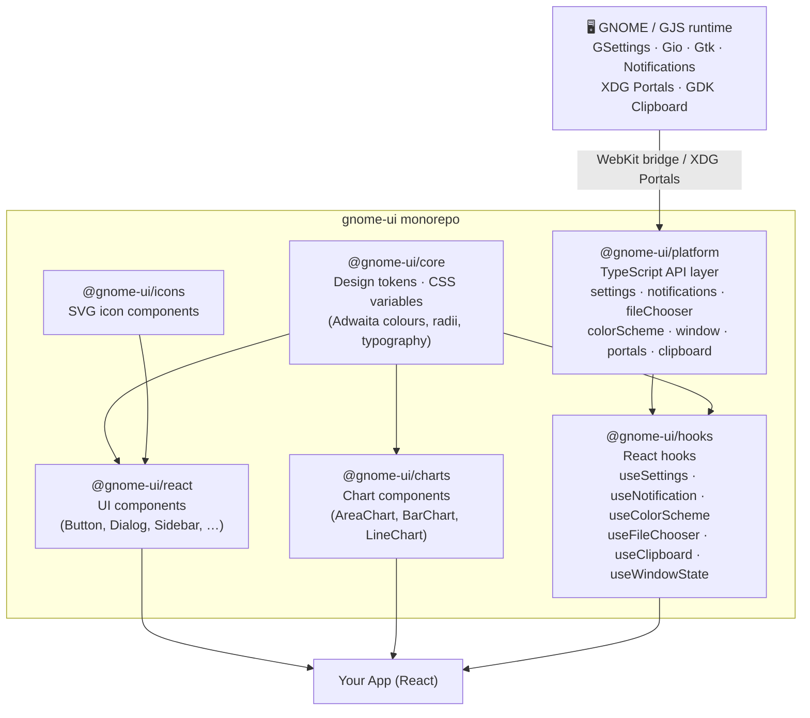

# Architecture — @gnome-ui

This document describes the package dependency graph and the role of each workspace in the monorepo.

## Package dependency graph



## Package roles

| Package | Role | React? | GNOME runtime? |
|---------|------|--------|----------------|
| `@gnome-ui/core` | Design tokens, CSS custom properties | No | No |
| `@gnome-ui/icons` | SVG icon components | Yes | No |
| `@gnome-ui/platform` | Low-level TypeScript bridge to GNOME APIs | No | Yes |
| `@gnome-ui/hooks` | React hooks that surface `platform` APIs | Yes | Via platform |
| `@gnome-ui/react` | Full Adwaita UI component library | Yes | No |
| `@gnome-ui/charts` | Recharts-based chart components styled with Adwaita tokens | Yes | No |

## Communication model

`@gnome-ui/platform` communicates with the GNOME host process through one of two mechanisms, resolved at runtime:

```
┌─────────────────────────────────────────────────┐
│  React App (WebKitGTK WebView or browser)        │
│                                                   │
│  @gnome-ui/platform                              │
│       │                                           │
│       ├─ WebKit bridge  ──► window.webkit         │
│       │   (GJS host)        .messageHandlers.*    │
│       │                                           │
│       └─ XDG Portals    ──► org.freedesktop.*     │
│           (Flatpak /        via postMessage /      │
│            browser)         fetch proxy            │
└─────────────────────────────────────────────────┘
```

When neither bridge is available (unit tests, standard browsers) every call falls back to a no-op stub so the application renders without crashing.

## Build order

```
@gnome-ui/core  →  @gnome-ui/platform  →  @gnome-ui/hooks
                →  @gnome-ui/icons     →  @gnome-ui/react
                                        →  @gnome-ui/charts
```

`@gnome-ui/hooks` depends on both `@gnome-ui/platform` (runtime) and `@gnome-ui/core` (tokens for any bundled UI).
